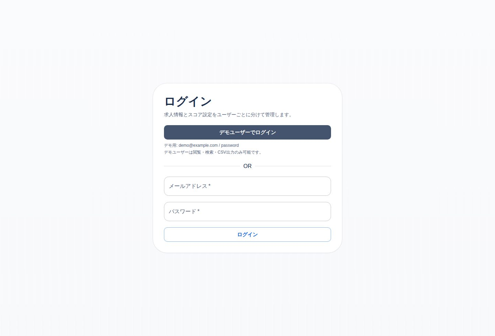
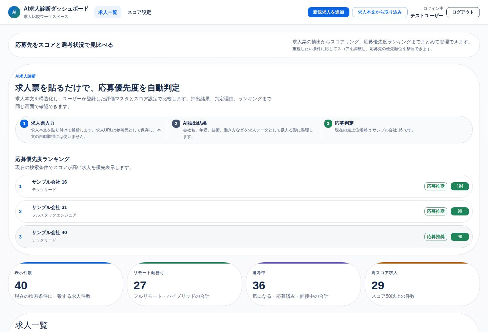
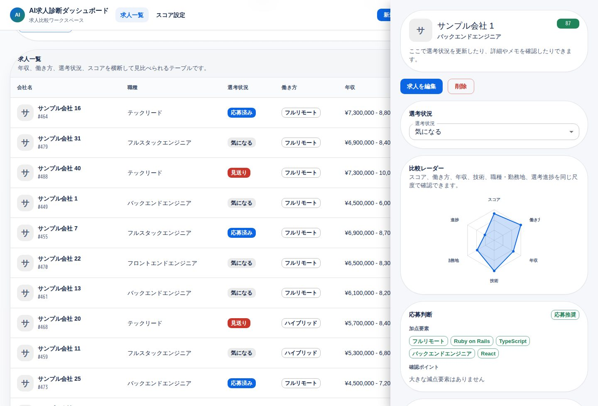
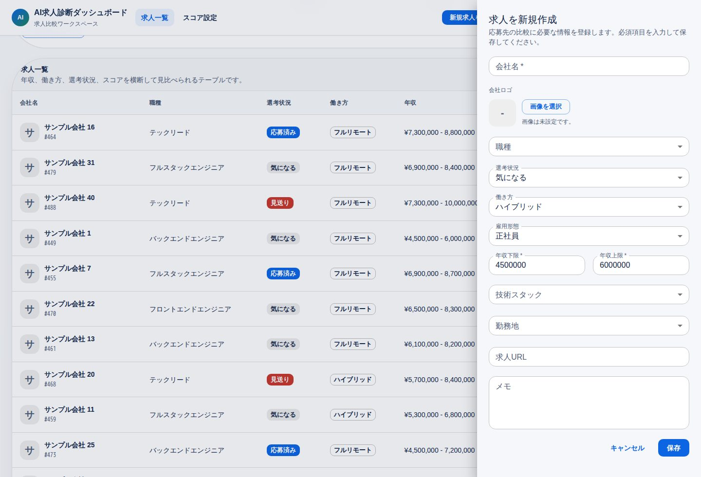
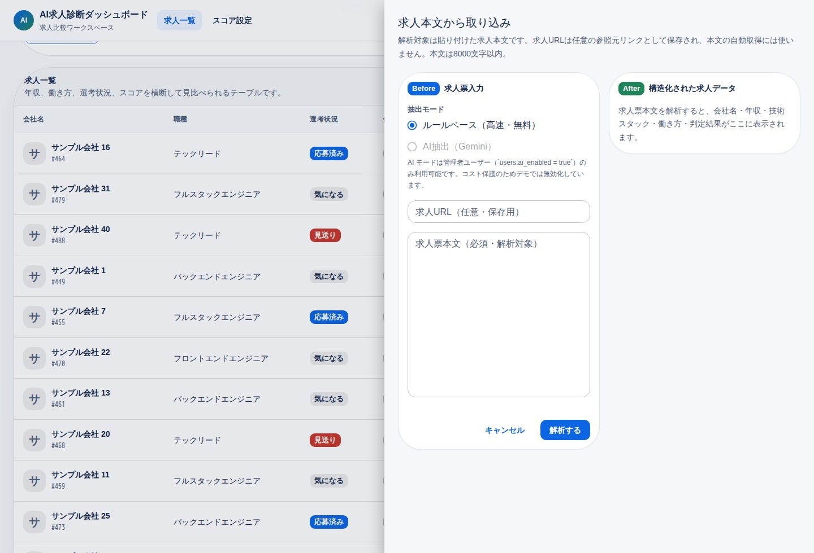
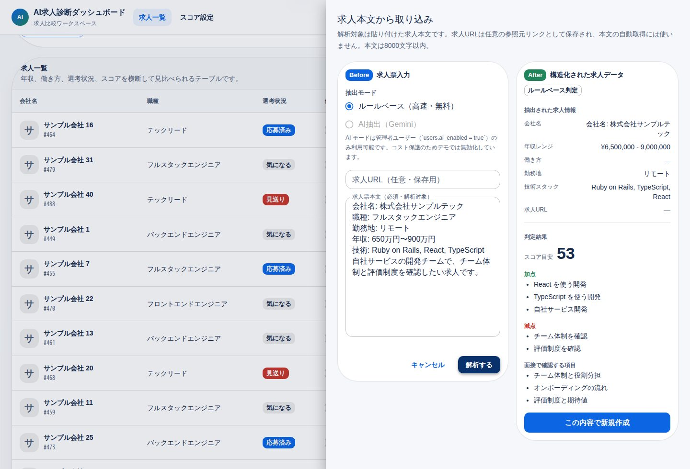
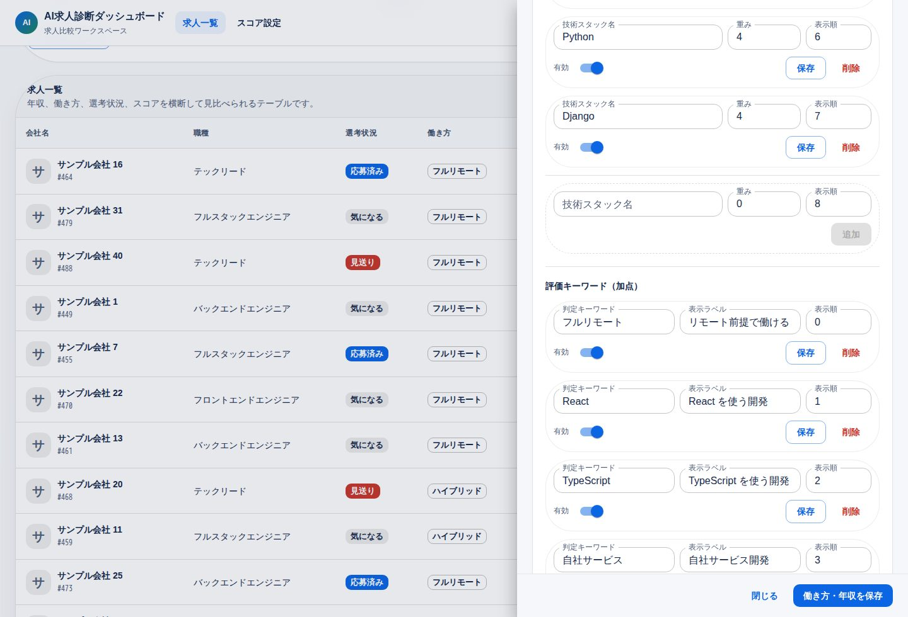

# AI求人診断ダッシュボード

[](https://github.com/naoki-webdev/job-compare-dashboard/actions/workflows/ci.yml)

デモ: https://job-compare-dashboard.onrender.com/
GitHub: https://github.com/naoki-webdev/job-compare-dashboard

このアプリは、求人票本文を貼り付けるだけで構造化情報を抽出し、自分の転職条件に基づいて応募優先度を判定する AI 求人診断ダッシュボードです。
Rails API + React / TypeScript 構成で、認証、ユーザー別求人管理、検索・絞り込み、CSV 出力、スコアリング、操作ログ、会社ロゴ管理、CI/CD、E2E テストまで実装しています。

単なる CRUD ではなく、求人票入力 → 構造化抽出 → ユーザー別評価マスタによる判定 → 応募優先度ランキングまでを一つの業務フローとして扱える設計にしています。一覧・CSV 出力・サマリー集計では同一の検索条件を再利用し、判断基準を変更した際にユーザーごとの求人スコアを再計算します。

公開デモではデモユーザーのみが read-only でログインできます。閲覧・検索・絞り込み・CSV 出力はそのまま利用できますが、求人の追加・編集・削除、スコア設定の更新はデモユーザーでは無効化しています。通常ユーザーではユーザーごとに分離した求人データを CRUD できる設計です。

評価ロジックは固定キーワードではなく、ユーザーが登録した評価マスタ（加点キーワード・減点キーワード・確認したい質問）を参照します。デモ環境では seed により初期マスタを demo ユーザーの登録済みデータとして用意しています。AI モードは `users.ai_enabled = true` のマスターユーザーのみ利用でき、通常ユーザーでは controller 側で rule モードに強制されます。read-only のデモユーザーでは、求人取り込みを含む書き込み系 API を 403 で拒否します。

デモログイン:

- メールアドレス: `demo@example.com`
- パスワード: `password`
- 権限: 閲覧専用（`users.read_only = true`）

## まず見てほしいポイント

- 求人票本文を貼ると、会社名・年収・勤務地・技術スタックを下書き化します。
- ユーザーが登録した評価マスタに基づいて、加点・減点・確認したい質問を表示します。
- 登録済み求人は、検索・絞り込み・応募優先度ランキング・CSV 出力で比較できます。
- 公開デモは閲覧専用のため、作成・更新・削除・スコア設定・求人本文取り込みは API 側で拒否します。
- スクリーンショットは機能説明用の通常ユーザー画面です。公開デモの `demo@example.com` では、書き込みにつながるボタンは表示しません。

## プロジェクトのハイライト

1. Bearer token 認証を追加し、求人データとスコア設定をユーザーごとに分離しています。
2. `JobsQuery` に検索・絞り込み・ソート・ページネーションを集約し、一覧表示・CSV 出力・サマリー集計で条件のずれを防いでいます。
3. `JobSerializer` / `JobsCsvExport` / service / controller に責務を分け、controller に処理を寄せすぎない構成にしています。
4. スコア設定やマスタデータの重みを変更したとき、関連する求人スコアを再計算して優先順位へ反映します。
5. ログイン後のトップで、AI 求人診断の流れ、主要指標、応募優先度ランキングを確認できます。
6. 求人詳細では、スコア内訳だけでなく比較レーダーと応募判断を表示します。
7. Minitest / Vitest / Playwright / GitHub Actions / Brakeman を入れ、実務に近い品質確認を行っています。
8. 求人作成・更新・削除、スコア設定更新を `ActivityLog` に残し、運用時の追跡性を意識しています。
9. ユーザーごとに `read_only` フラグを持たせ、公開デモ用のアカウントは書き込みを API 層で拒否しています。通常ユーザーはユーザー単位で CRUD できる設計です。
10. 求人本文の判定はユーザー登録済みの評価マスタだけを参照し、未登録のキーワードを暗黙に判定しない設計にしています。

## なぜこのアプリを作ったか

転職活動中、見比べたい求人が増えてくると、スプレッドシートで並べるだけでは優先順位をつけづらくなりました。
求人票、技術スタック、働き方、年収、選考状況など、比較したい情報が複数の軸にまたがるからです。

そこで、自分の基準で重み付けしながら比較できるアプリを作りました。
フルリモートや技術スタック、年収帯にスコアを反映し、一覧・詳細確認・CSV出力までまとめて扱えるようにしています。

## 画面イメージ

### ログイン



ユーザーごとに求人・スコア設定・評価マスタを分離します。デモユーザーは閲覧専用です。

### AI求人診断トップ



求人票入力、AI抽出結果、応募判定の流れと、応募優先度ランキングを最初に確認できます。下部ではキーワード検索、絞り込み、ソート、CSV出力もまとめて操作できます。公開デモでは閲覧・検索・絞り込み・CSV出力を試せます。

### 詳細ドロワー



選考状況の更新、求人情報の確認、編集、削除を1か所で行えます。比較レーダーと応募判断で、スコアの見え方も確認できます。

### 新規作成 / 編集フォーム



新規作成と編集は共通フォームにして、会社名・職種・働き方・年収・技術スタック・勤務地・求人URL・メモの入力ルールを揃えています。通常ユーザー向けの機能で、公開デモユーザーでは API 側でも書き込みを拒否します。

### 求人本文から取り込み



求人URLは保存用の参照元リンク、求人票本文は解析対象として分けて入力します。AI抽出は管理者ユーザーだけが選択できます。

### 判定結果



抽出した求人情報、スコア目安、加点・減点・面接で確認する項目を表示します。判定理由はユーザーが登録した評価マスタだけを参照します。

### スコア設定



働き方・年収の重み、勤務地・職種・技術スタックの比較マスタ、求人本文の判定に使う加点キーワード・減点キーワード・確認したい質問をユーザーごとに編集できます。

## 主な機能

- 求人一覧、キーワード検索、ステータス・働き方の絞り込み、ソート、ページネーション
- ログイン、ユーザーごとの求人分離、自分の求人だけを表示・編集
- ユーザーごとのスコア設定
- ユーザーごとの評価マスタ（加点キーワード・減点キーワード・確認したい質問）
- 求人作成・更新・削除、スコア設定更新の操作ログ
- 絞り込み条件に連動したダッシュボードサマリー（リモート可 / 選考中 / 高スコア件数）
- AI求人診断トップ（求人票入力の導線、応募優先度ランキング、主要指標）
- 求人の新規作成、編集、削除（URL とリンクの保存）
- 求人本文の貼り付けからの取り込み（URL は任意の参照元リンクとして保存、ルールベース ＋ Gemini 2.5 Flash による AI 抽出）
- AI 判定（加点・減点・面接で確認する項目・推定スコア）
- 会社ロゴ画像のアップロード、削除、一覧・詳細でのサムネイル表示
- 詳細ドロワーでの選考ステータス更新
- スコア設定の編集（働き方・年収・職種・勤務地・技術スタックの重み付け）
- 詳細ドロワーでのスコア内訳、比較レーダー、応募判断表示
- 日本語対応の CSV 出力（BOM 付き UTF-8）

## 技術構成

- Backend: Ruby 3.3 + Ruby on Rails 8 (API mode)
- Frontend: React 19 + TypeScript 5.8 + Vite 6 + MUI 7
- Database: PostgreSQL 16
- Auth: `has_secure_password` + signed Bearer token
- File upload: Active Storage
- Infra（ローカル）: Docker Compose
- Infra（本番）: Render + Supabase PostgreSQL
- Test: Minitest / Vitest / Playwright
- CI: GitHub Actions
- I18n: Rails I18n + YAML ベースのフロント文言管理

## 設計のポイント

**レイヤ分割と責務**

- Rails は認証・API・CSV 出力・スコア計算・検索条件の組み立てを担当、React は UI・ログイン状態・フォーム・フィルタ・詳細表示を担当
- controller は薄く保ち、JSON 整形は `JobSerializer`、CSV 生成は `JobsCsvExport`、一覧検索は `JobsQuery` に分離
- フロントは `useJobsDashboard` を中心に、一覧取得・マスタ管理・スコア設定の hooks を分け、lazy load で初期表示を軽くしている

**認証とユーザー分離**

- `ApplicationController` で Bearer token を検証し、API リクエストをログインユーザーに紐づけ
- 求人とスコア設定はユーザーに紐づけ、自分のデータだけを扱う
- 職種・勤務地・技術スタックはマスタ参照で正規化し、API レスポンスでは表示用の文字列に整形
- 読み取り専用ユーザー（`users.read_only`）の書き込み系 API は 403 で拒否し、公開デモを壊されない設計。通常ユーザーはユーザー単位で求人とスコア設定を CRUD 可能

**検索・スコアの一貫性**

- `JobsQuery` に検索・絞り込み・ソート・ページネーションを集約し、一覧表示・CSV 出力・サマリー集計で条件のずれが出ない
- スコア設定やマスタデータの重みを変更したとき、ログインユーザーの関連求人スコアを再計算して優先順位に反映

**ファイル添付と AI 抽出**

- 会社ロゴは Active Storage で管理し、画像付き作成・更新時のみ `multipart/form-data`、通常更新は JSON のまま送信
- 画像は image MIME type と 5MB 上限で制限し、一覧では会社名の左にサムネイル、未設定時は頭文字アイコンを表示
- 求人本文の取り込みは `JobDrafts::Builder` を入口に、`RuleBasedParser`（正規表現ベース）と `AiExtractor`（Gemini 2.5 Flash）を切り替え可能にして、API キーがなくても動作する設計。URL は自動 fetch せず、参照元リンクとして保存する。AI 失敗時はルールへフォールバック
- AI プロンプトにマスタ名（勤務地・技術スタック）とユーザー別の評価マスタを context として渡し、Gemini に候補名や判定理由を寄せて返させ、バックエンドで master id に解決してフォーム入力にそのまま使える形にしている

**運用と追跡性**

- 求人・スコア設定の作成/更新/削除を `ActivityLog` に記録し、誰がいつ何を変更したか後から追跡可能

## データモデル

- `User` - ログインユーザー（`read_only` で書き込み禁止、`ai_enabled` で AI モード許可を制御）
- `Job` - 求人本体（会社名、会社ロゴ画像、選考状況、働き方、雇用形態、年収、メモ、求人URL、スコアなど）
- `ScoringPreference` - ユーザーごとのスコア計算に使う重み付け設定
- `ActivityLog` - 求人やスコア設定に対する操作ログ
- `Position` / `Location` / `TechStack` - 比較条件として使うマスタデータ
- `PositiveKeyword` / `NegativeKeyword` / `InterviewQuestion` - 求人本文の判定に使うユーザー別評価マスタ
- `JobTechStack` - `Job` と `TechStack` の中間テーブル

`status` / `work_style` / `employment_type` は Rails enum で扱い、アプリ側で利用できる値を明確にしています。

## セットアップ

```bash
make setup
```

- Docker コンテナ起動
- `bundle install`
- `npm install`
- `bin/rails db:prepare`
- 求人データが空なら `db:seed`

```bash
make up
```

- `make setup`
- Vite dev server 起動（`http://127.0.0.1:5173`）

## テスト

- Rails: Minitest
- Frontend: Vitest
- E2E: Playwright

```bash
docker compose exec -T web bin/rails test
make test-frontend
make e2e
make verify
make verify:e2e
```

Rails 側は integration test で一覧・作成・更新・削除・会社ロゴ画像の添付 / 削除・CSV 出力・マスタ CRUD・求人本文取り込み・read-only ユーザーの書き込み拒否を確認しています。
フロント側は主要コンポーネント、custom hook、ユーティリティに単体テストを用意しています。
E2E では一覧表示、read-only デモユーザーの書き込み拒否、求人本文取り込み、応募優先度ランキング、詳細ドロワーの比較レーダー、新規作成、ステータス更新、削除、CSV ダウンロード、マスタ設定を確認しています。

## 品質確認

ローカルでは以下のコマンドで、Rails / React / E2E / セキュリティチェックをまとめて確認できます。

```bash
make ci
make e2e
```

GitHub Actions でも同等のチェックを実行し、Brakeman、RuboCop、Rails test、frontend lint / test / build、Playwright E2E を自動確認しています。

## Terraform

追加コストを出さない範囲で、Render の無料 Blueprint 構成を Terraform で読み取り、`init` / `validate` / `plan` で設定確認する用途に限定しています。

## CI

GitHub Actions で以下を自動実行しています。

- Brakeman
- RuboCop
- Rails test
- frontend lint / test / build
- Playwright smoke E2E

## AI 抽出 (求人本文の取り込み)

ダッシュボード右上の「求人本文から取り込み」ボタンから、求人票本文を貼り付けて構造化情報と判定結果を生成できます。求人URLは任意入力で、解析には使わず `source_url` として保存します。

URLから求人本文を自動取得する処理は、媒体ごとのHTML差分、ログイン必須ページ、robots.txt / 利用規約、CORS、取得失敗時の扱いを別途設計する必要があるため、このアプリでは本文貼り付け方式にしています。

- **ルールベース**: 正規表現ベースで `年収 / 技術スタック / 勤務地` を抽出し、`pros / cons / questions` はログインユーザーが登録した評価マスタだけを参照して生成。API キー不要、コストゼロ。
- **AI抽出 (Gemini 2.5 Flash)**: `GEMINI_API_KEY` を設定すると、Google Gemini 2.5 Flash を呼び出して同じスキーマで構造化出力（`responseMimeType: application/json`）。失敗時はルールベースに自動フォールバック。

無料枠の Gemini 2.5 Flash を採用したのは、ポートフォリオの公開デモで「クレカ登録不要・コスト気にせず触れる」状態を保つため。Anthropic / OpenAI への切替は `JobDrafts::AiExtractor` のみを書き換えれば可能。

### コスト保護

公開デモには次の防御を入れています：

- **AI モードは `users.ai_enabled = true` のマスターユーザーのみ利用可能** — controller で `current_user.ai_enabled?` を見て、通常ユーザーでは `mode=rule` に強制。フロントでも AI のラジオを `disabled` にして「管理者のみ」と表示
- **デモユーザー (`users.read_only`) は書き込み系 API を 403 で拒否** — 求人作成・更新・削除、スコア設定、マスタ更新、求人取り込みをフロントだけでなく API 層で守る
- **デモメールアドレスへの保険** — `read_only` フラグが何らかの理由で落ちても、`DEMO_USER_EMAIL` で指定したデモアカウントは controller がメール一致で write を拒否
- **本文 8000 文字上限** — controller で 422 拒否
- **AI 失敗時は自動でルールへフォールバック** — 余計なリトライをしない
- **Gemini console / Render 側の usage limit を別途設定推奨**

マスターユーザーの追加は console から（公開しないため seed には含めません）:

```ruby
docker compose exec web bin/rails c
User.create!(name: "管理者", email: "you@example.com", password: "...", read_only: false, ai_enabled: true)
```

### Gemini API 設定

```bash
# ローカル
# .env に GEMINI_API_KEY=... を設定してから起動
docker compose up -d --build web frontend
# Render
# Environment → GEMINI_API_KEY を追加
```

無料 API キーは https://aistudio.google.com/app/apikey から取得できます（クレカ不要・即発行）。Gemini API の無料枠やレート制限は変更される可能性があるため、最新値は公式の [Rate limits](https://ai.google.dev/gemini-api/docs/rate-limits) を確認してください。

API キーが未設定の場合、フロントは「AI 抽出は GEMINI_API_KEY 未設定のためルールベースに自動切替」のヒントを表示します。

### スキーマ

```
POST /api/job_drafts
{ "job_draft": { "mode": "rule" | "ai", "url": "...", "text": "..." } }

→ { "mode": "rule"|"ai", "ai_available": bool,
     "draft": { company_name, source_url, salary_min, salary_max,
                work_style, tech_stack_ids, tech_stack_names,
                location_id, location_name },
     "insights": { score_estimate, pros[], cons[], questions[] } }
```

入力検証：`text` 空欄 → 422、`text` 8000 文字超 → 422、通常ユーザーで AI モードを指定した場合は `mode` を `rule` に強制、read-only ユーザーは求人取り込み自体を 403 で拒否します。ルールベース判定で参照する評価キーワードと確認事項はユーザー別マスタのみで、ユーザーが何も登録していない場合は `pros / cons / questions` を空で返します。

## 今後の改善候補

- 求人URL から本文を fetch して貼り付け不要にする（CSP / robots.txt 配慮あり）
- AI 抽出のキャッシュ・レート制限・コスト計測を入れる
- 操作ログの一覧画面を追加し、運用時の監査性をさらに高める
- 会社ロゴの自動取得や外部ストレージ連携を検討する
- E2E の安定化と実行時間の短縮
