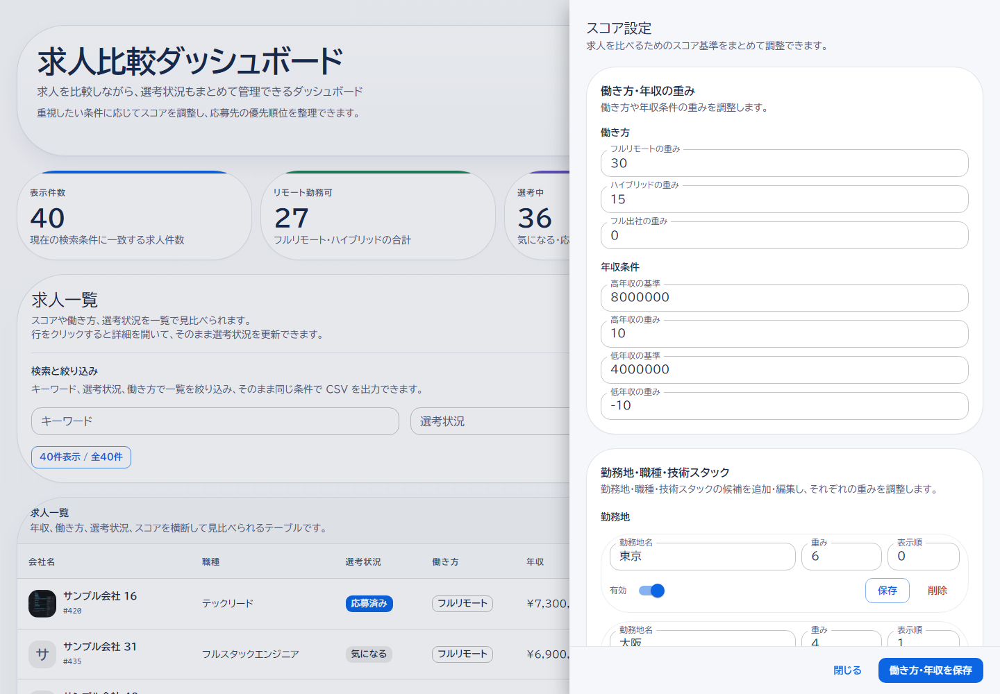

# 求人比較ダッシュボード

[](https://github.com/naoki-webdev/job-compare-dashboard/actions/workflows/ci.yml)

デモ: https://job-compare-dashboard.onrender.com/  
GitHub: https://github.com/naoki-webdev/job-compare-dashboard

転職活動中の求人を一覧で管理し、比較・優先順位付けできるポートフォリオアプリです。  
働き方、年収、技術スタックなどに応じてスコアを調整でき、一覧・詳細・編集・削除・会社ロゴ画像の管理・CSV 出力・スコア設定の編集までまとめて扱えます。

公開デモは read-only です。画面確認と CSV 出力はできますが、データの追加・更新・削除は本番環境では無効化しています。

## なぜこのアプリを作ったか

転職活動中、見比べたい求人が増えてくると、スプレッドシートで並べるだけでは優先順位をつけづらくなりました。  
求人票、技術スタック、働き方、年収、選考状況など、比較したい情報が複数の軸にまたがるからです。

そこで、自分の基準で重み付けしながら比較できるアプリを作りました。  
フルリモートや技術スタック、年収帯にスコアを反映し、一覧・詳細確認・CSV出力までまとめて扱えるようにしています。

## 画面イメージ

### 一覧画面


キーワード検索、絞り込み、ソート、CSV出力をまとめて操作できます。

### 詳細ドロワー


選考状況の更新、求人情報の確認、編集、削除を1か所で行えます。

### 新規作成 / 編集フォーム


新規作成と編集は共通フォームにして、入力ルールを揃えています。

### スコア設定



働き方・年収の重みと、勤務地・職種・技術スタックをまとめて調整できます。

## 主な機能

- 求人一覧、キーワード検索、ステータス・働き方の絞り込み、ソート、ページネーション
- 絞り込み条件に連動したダッシュボードサマリー（リモート可 / 選考中 / 高スコア件数）
- 求人の新規作成、編集、削除
- 会社ロゴ画像のアップロード、削除、一覧・詳細でのサムネイル表示
- 詳細ドロワーでの選考ステータス更新
- スコア設定の編集（働き方・年収・職種・勤務地・技術スタックの重み付け）
- 日本語対応の CSV 出力（BOM 付き UTF-8）

## 技術構成

- Backend: Ruby 3.3 + Ruby on Rails 8 (API mode)
- Frontend: React 19 + TypeScript 5.8 + Vite 4 + MUI 7
- Database: PostgreSQL 16
- File upload: Active Storage
- Infra（ローカル）: Docker Compose
- Infra（本番）: Render + Supabase PostgreSQL
- Test: Minitest / Vitest / Playwright
- CI: GitHub Actions
- I18n: Rails I18n + react-i18next

## 設計のポイント

- Rails は API と CSV 出力、フロントは UI と状態管理を担当
- 職種・勤務地・技術スタックはマスタ参照で正規化し、API レスポンスでは表示用の文字列に整形
- controller は薄く保ち、JSON 整形は `JobSerializer`、CSV 生成は `JobsCsvExport`、一覧検索は `JobsQuery` に分離
- フィルタ条件とソートは `JobsQuery` にまとめ、一覧と CSV で同じ条件を使う
- スコア設定を更新したときは既存求人のスコアも再計算
- 本番環境は read-only mode で書き込み系 API を拒否
- フロントは custom hook と lazy load で役割を分離

## 設計・実装の特筆点

- `JobsQuery` に検索・絞り込み・ソート・ページネーションを集約し、一覧表示と CSV 出力で条件のずれが出ないようにしています。
- `JobSerializer` / `JobsCsvExport` / controller を分け、API レスポンス整形・CSV 生成・HTTP の責務を分離しています。
- スコア設定やマスタデータの重みを変更したとき、関連する求人スコアを再計算して一覧の優先順位に反映します。
- 会社ロゴ画像は Active Storage で管理し、画像付きの作成・更新時だけ `multipart/form-data`、通常の更新は JSON のまま送信するようにしています。
- アップロード画像は image MIME type と 5MB 上限で制限し、一覧では会社名の左にサムネイル、未設定時は頭文字アイコンを表示します。
- 公開デモは `ApplicationController` の read-only mode で書き込み系リクエストを API 層から拒否し、画面確認だけ安全にできるようにしています。
- React 側は `useJobsDashboard` を中心に、一覧取得・マスタ管理・スコア設定の hooks を分けて状態管理を整理しています。

## データモデル

- `Job` - 求人本体（会社名、会社ロゴ画像、選考状況、働き方、雇用形態、年収、メモ、スコアなど）
- `ScoringPreference` - スコア計算に使う重み付け設定
- `Position` / `Location` / `TechStack` - 比較条件として使うマスタデータ
- `JobTechStack` - `Job` と `TechStack` の中間テーブル

`status` / `work_style` / `employment_type` は Rails enum と PostgreSQL enum を併用して、アプリ側と DB 側の両方で値を制約しています。

## セットアップ

```bash
make setup
```

- Docker コンテナ起動
- `bundle install`
- `npm install`
- `bin/rails db:prepare`
- 求人データが空なら `db:seed`

```bash
make up
```

- `make setup`
- Vite dev server 起動（`http://127.0.0.1:5173`）

## テスト

- Rails: Minitest
- Frontend: Vitest
- E2E: Playwright

```bash
docker compose exec -T web bin/rails test
make test-frontend
make e2e
```

Rails 側は integration test で一覧・作成・更新・削除・会社ロゴ画像の添付 / 削除・CSV 出力・マスタ CRUD を確認しています。  
フロント側は主要コンポーネント、custom hook、ユーティリティに単体テストを用意しています。  
E2E では一覧表示、キーワード絞り込み、新規作成、ステータス更新、削除、CSV ダウンロード、マスタ設定を確認しています。

## 品質確認

ローカルでは以下のコマンドで、Rails / React / E2E / セキュリティチェックをまとめて確認できます。

```bash
make ci
make e2e
```

GitHub Actions でも同等のチェックを実行し、Brakeman、RuboCop、Rails test、frontend lint / test / build、Playwright E2E を自動確認しています。

## Terraform

追加コストを出さない範囲で、Render の無料 Blueprint 構成を Terraform で読み取り、`init` / `validate` / `plan` で設定確認する用途に限定しています。

## CI

GitHub Actions で以下を自動実行しています。

- Brakeman
- RuboCop
- Rails test
- frontend lint / test / build
- Playwright smoke E2E

## 今後の改善候補

- 認証を追加してユーザーごとの求人管理に広げる
- 会社ロゴの自動取得や外部ストレージ連携を検討する
- E2E の安定化と実行時間の短縮
