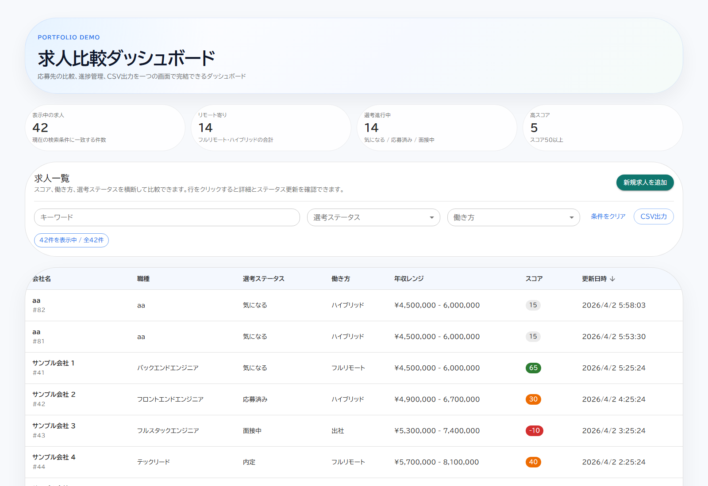
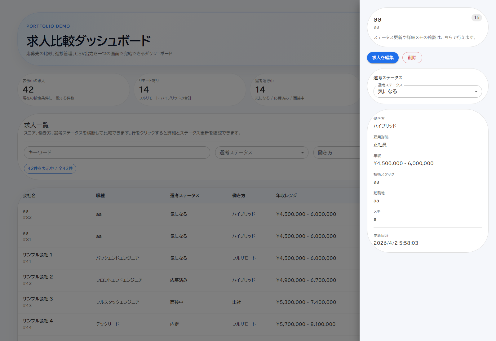
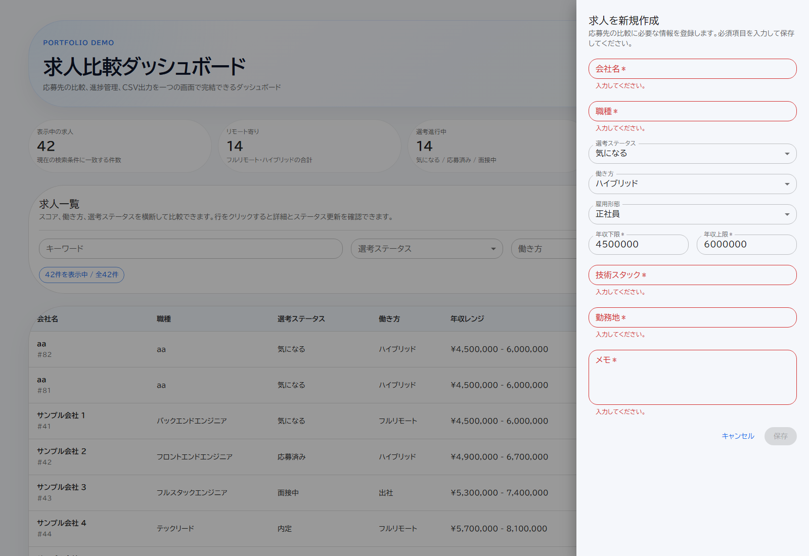

# 求人比較ダッシュボード

応募先の比較、選考ステータス管理、CSV出力をまとめて行えるポートフォリオアプリです。  
Rails API と React フロントエンドを分離し、一覧・詳細・更新・エクスポートまでを一通り体験できる構成にしています。

## 画面イメージ

### 一覧画面



一覧画面では、キーワード検索、絞り込み、ソート、CSV出力をまとめて操作できます。

### 詳細ドロワー



詳細ドロワーでは、選考ステータスの更新、編集、削除を1箇所で行えます。

### 新規作成フォーム



新規作成 / 編集フォームは共通UIにして、必須入力とバリデーションを揃えています。

## できること

- 求人一覧の表示
- 求人の新規作成
- 求人の編集
- 求人の削除
- キーワード検索
- 選考ステータス / 働き方による絞り込み
- ソートとページネーション
- 詳細ドロワーでのステータス更新
- 日本語CSV出力
- 必須項目付きフォームでの新規作成 / 編集
- 削除確認付きの削除導線

## 技術構成

- Backend: Ruby on Rails 8 API mode
- Frontend: React + TypeScript + Vite + MUI
- Database: PostgreSQL 16
- Infra / local setup: Docker Compose
- I18n: Rails I18n + react-i18next

## データモデル概要

### Job

- `company_name`: 会社名
- `position`: 職種名
- `status`: 選考ステータス
- `work_style`: 働き方
- `employment_type`: 雇用形態
- `salary_min`: 年収下限
- `salary_max`: 年収上限
- `tech_stack`: 技術スタック
- `location`: 勤務地
- `notes`: メモ
- `score`: 比較用スコア
- `created_at` / `updated_at`: 作成・更新日時

### enum 管理

- `status`: `interested` / `applied` / `interviewing` / `offer` / `rejected`
- `work_style`: `full_remote` / `hybrid` / `onsite`
- `employment_type`: `full_time` / `contract`

Rails の enum と PostgreSQL enum を併用して、アプリケーション側とDB側の両方で値を制約しています。

### ScoringPreference

- `full_remote_weight`
- `hybrid_weight`
- `onsite_weight`
- `rails_weight`
- `typescript_weight`
- `high_salary_max_threshold`
- `high_salary_bonus`
- `low_salary_min_threshold`
- `low_salary_penalty`

スコアの重み付けは固定値ではなく、後から UI で編集できるようにしています。

## 画面と設計のポイント

- Rails は API と CSV出力、フロントは UI と状態管理に責務を分離
- `status` `work_style` `employment_type` は Rails enum と PostgreSQL enum で管理
- CSV は Excel で開きやすいよう BOM 付き UTF-8 で出力
- サンプルデータは日本語前提で seed し、画面とCSVの見え方を揃えている
- フィルタ条件とソートをクエリ化し、一覧とCSVで同じ条件を再利用している
- フロントは hooks と lazy load を使い、責務分離と初期表示の軽量化を両立している

## セットアップ

### 1. コンテナ起動

```bash
docker compose up -d db web
```

### 2. DB初期化

```bash
docker compose exec web bin/rails db:create db:migrate db:seed
```

### 3. フロントエンド起動

```bash
npm install
npm run dev
```

- Frontend: `http://localhost:5173`
- API: `http://localhost:3000`

## 環境変数

`.env.example` を参考に `.env` を作成できます。

- `VITE_API_BASE_URL=http://localhost:3000`

## API

### `GET /api/jobs`

クエリ:
- `keyword`
- `status`
- `work_style`
- `sort`
- `direction`
- `page`
- `per_page`

### `GET /api/jobs/:id`

求人詳細を取得します。

### `PATCH /api/jobs/:id`

選考ステータスなどを更新します。

```json
{
  "job": {
    "status": "interviewing"
  }
}
```

### `POST /api/jobs`

求人を新規作成します。

### `DELETE /api/jobs/:id`

求人を削除します。

### `GET /api/jobs/export`

一覧と同じ絞り込み条件でCSVを出力します。

### `GET /api/scoring_preference`

現在のスコア設定を取得します。

### `PATCH /api/scoring_preference`

スコアの重み付け基準を更新します。

## テスト

```bash
bin/rails test
```

CSV出力に加えて、一覧取得とステータス更新の基本動作も integration test で確認しています。

確認している主な観点:
- 一覧取得の絞り込み
- 一覧のソート
- ステータス更新
- 求人の新規作成
- 求人の削除
- バリデーション失敗時の 422 応答
- CSVエクスポートの日本語化

## ポートフォリオとしての見どころ

- API と UI を分離した構成でも、MVPを最後まで形にしていること
- 日本語UI、CSV出力、enum管理など業務アプリに近い観点を含めていること
- 見た目だけでなく、検索・更新・エクスポートまで一連の操作が成立していること

## 今後の改善候補

- フォームのサーバー返却エラーを項目単位で表示する
- 認証を追加してユーザーごとの求人管理に広げる
- デプロイURLを追加する
